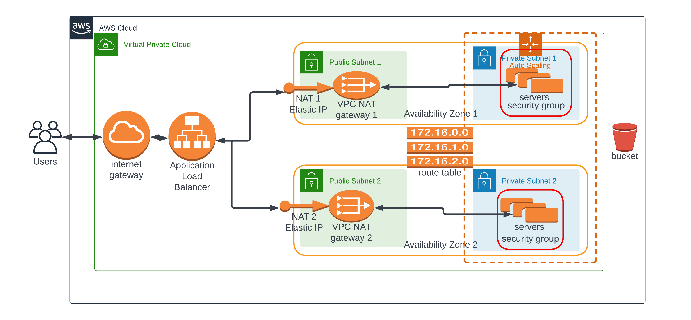

# High Availability Web Infrastructure on Amazon Web Services (AWS)
This project demos how to provision a high availability web infrastructure to AWS cloud using cloudformation scripts and other AWS resources.
## How it works
The infrastructure diagram is as shown below:



During provisioning, when the stack is created or updated the webservers pull source code from the S3 bucket.

## Usage
Shell Scripts has been written to automate the infra deployment process.
Each of the shell scripts take two arguments

1. The operation: which is either *create-stack* or *update-stack*
2. The name of the stack.

- First you have to create an S3 bucket and upload the contents of *bucket-contents* to the root of the S3 bucket.
- Open *network-params.json* and *server-params.json* files and change the parameters to suit your use case.
- Deploy the network infrastructure
    Navigate to the root directory of the project and execute the following command.

    *For windows*
    ```shell
    network_deploy.bat create-stack <StackName>
    ```
    *For Linux*
    ```shell
    bash network_deploy.sh create-stack <StackName>
    ```
    OR

    ```shell
    chmod ./network_deploy.sh
    ./network_deploy.sh create-stack <StackName>
    ```

    To update the stack simply change *create-stack* to *update-stack* in the commands above.

- Deploy the Web Server infrastructure.
    Still on the root directory of the project, excute the following command.

    *For windows*
    ```shell
    server_deploy.bat create-stack <StackName>
    ```
    *For Linux*
    ```shell
    bash server_deploy.sh create-stack <StackName>
    ```
    OR

    ```shell
    chmod ./server_deploy.sh
    ./server_deploy.sh create-stack <StackName>
    ```
    To update the stack simply change *create-stack* to *update-stack*

Go to your cloud console and viola! you will see the link to the webserver via the stack exported output.
See the [example deployement](http://webse-webap-1np11kjwm7afr-2065955315.us-east-1.elb.amazonaws.com) from this scripts, let's hope it's still available.# high-availability-infra
